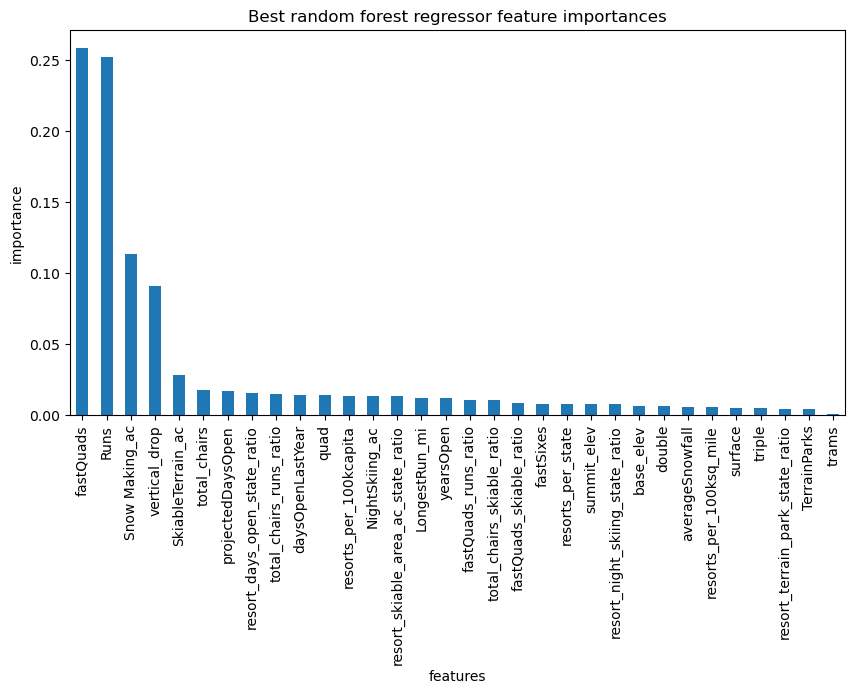
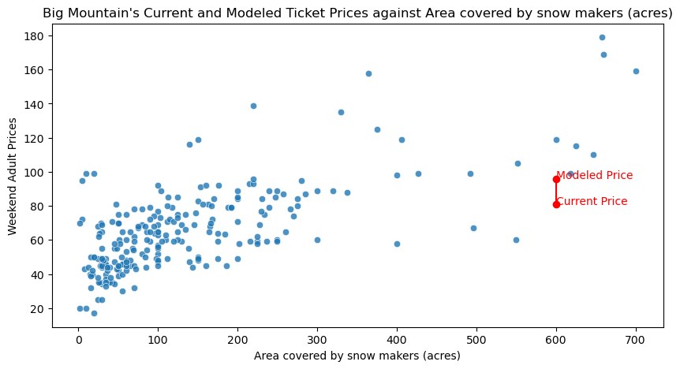

# A New Price Model for Big Mountain Resort
Mark Cohen

## 1. Problem statement

Big Mountain Resort has recently invested in a new chairlift. While improving visitor access across different trails, the associated costs have suggested a need to reassess the resort’s pricing strategy, which is currently based on a premium on the market average. The goal of this project was to develop a pricing model that allows Big Mountain Resort to locate itself more precisely among its competition. Furthermore, this model will help to identify the resort facilities that are most and least associated with competitive pricing, to guide further investments or cost-cutting initiatives.

## 2. Data

### 2.1 Wrangling the Data

The raw data data on 27 distinct measures for 330 ski resorts in the United States. The cleaned data for resorts was trimmed to 277 rows and 25 columns, including the target feature for the price model: adult weekend prices. The two dropped columns recorded fast octuple lifts and weekday adult ticket prices. For the former, only one resort reports having such a lift, and half of the resorts included no data at all, so it provides no useful information. For the latter, it was dropped because the pricing model will focus on weekend prices, since these are available for more of the resorts. All but one of the observations dropped were because they lacked data on ticket prices. The one other was an anomalous case listed as having been established for 2019 years.

This resort-level measures are supplemented by a state-level dataset with totals of key measures in the resort data, plus area and population. From the state-level data, the number of resorts per state and the ratios of resorts to state area and population are included. Other state-level measures were used to add features measuring the share of state capacity represented by each resort.

The final dataset used to train the model, excluding Big Mountain Resort itself, consisted of 276 observations on 36 features.

### 2.2 Exploring the Data

An inspection of the bivariate correlations in the data already suggested that *vertical drop*, *number of runs*, and *number of chairs* were features with marked associations with adult weekend ticket prices.

On the other hand, state-level variables did not show strong patterns in relation to ticket prices. A principal component analysis of the state-level data, including average ticket prices, revealed no clear patterns, and the model selection detailed below did not highlight state shares as significant predictive factors. This is perhaps an area for future investigation: are Big Mountain's direct competitors other large Rocky Mountain region resorts, rather than the smaller ski areas of the coasts?

## 3. Model Preprocessing and Selection

The best-performing model is a random forest with 69 trees, using median imputation for missing values and no scaling. Compared to a baseline of using the mean ticket price, which is on average \$19 away from the observed price, the random forest model was less than \$10 off in estimates from cross validation.

A linear model was also considered. Fitting a model on all features explained about 80% of the variance of the price in the training set but only 72% in the test set, suggesting over-fitting. Using cross-validated grid search for the optimal number of features, the best linear model was just over \$10 off on average in its predictions in cross validation. The features identified were:
1. **vertical drop**
1. **acres of snow making**
1. **total number of chairlifts**
1. **number of fast quads chairlifts**
1. **total number of runs**
1. the length of the longest run
1. the number of trams
1. **the total skiable acreage**

The features in bold were also identified as the most important by the random forest model, as shown in the chart below.

As for the random forest model, a cross-validated grid search was used to determine the best combination of missing-value falling (mean or median), scaling (or not), and number of trees (between 10 and 1000).

## 4. Findings from the Final Model

### 4.1 Expected Price Level

Our new price model suggests that the market could bear a significantly higher ticket price for Big Mountain: over $95 as opposed to current price of $81. Big Mountain's vertical drop, number of runs and chairlifts, and above all snowmaking area are all among the top ski resorts in the country. For example, Big Mountain charges noticeably lower prices than other resorts with similar areas covered by snow making, as seen in the following figure:

At a minimum, this finding should provide confidence that ticket prices can be increased to cover the costs of the new chairlift. Assuming a constant level of 350,000 visitors skiing for an average 5 days each, a $1 increase to ticket prices would more than cover the additional $1.54 million in annual costs.

### 4.2 Predicted Impact of Cost-cutting or Investment Strategies

In terms of the predicted marginal effects of other changes, two of the proposals currently being discussed show some promise. First, the model suggests that there is margin to close some runs. 1 fewer run would make no difference to the predicted market-level price, and closing up to 5 runs would reduce the expected price by less than $1. Second, adding an additional run and chairlift that extend the resort's vertical drop by 150 feet would increase the ticket value by $1.99.

## 5. Conclusion and Future Work

The top-line conclusion of this analysis is that the suspicion that Big Mountain was not fully capitalizing on its exceptional facilities was well-founded. The current ticket price of $81 is above the national average, but relative to what Big Mountain offers to its visitors it is actually well below market level.

There are limits to modeling prices in isolation from volume. Both investments in new facilities and charging "below market" prices should be expected to attract additional visitors. The price model presented here cannot answer whether the new chairlift or the current price, lower than what would be expected based on Big Mountain's amenities, "pay for themselves" by increasing the quantity of tickets sold. Data on visitor numbers would help in addressing this question.

More modestly, with estimates of the additional or reduced costs of alternative strategies (closing runs, adding vertical drop, etc), this model could be used to assess in more detail the profitability of different proposals.
